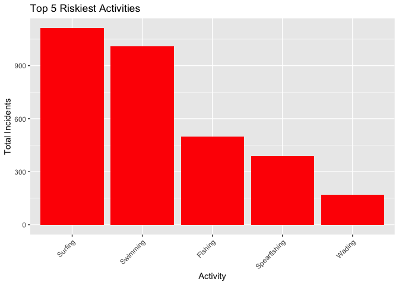
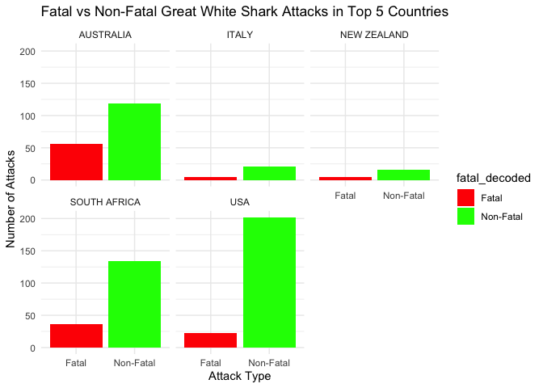

## Instructions
Answer the following questions and complete the exercises in RMarkdown. Please embed all of your code and push your final work to your repository. Your code must be organized, clean, and run free from errors. Remember, you must remove the `#` for any included code chunks to run. Be sure to add your name to the author header above. 

Your code must knit in order to be considered. If you are stuck and cannot answer a question, then comment out your code and knit the document.  

Don't forget to answer any questions that are asked in the prompt. Some questions will require a plot, but others do not- make sure to read each question carefully.  

For the questions that require a plot, make sure to have clearly labeled axes and a title. Keep your plots clean and professional-looking, but you are free to add color and other aesthetics.  

Be sure to follow the directions and push your code to your repository.

## Background
In the `data` folder, you will find data about global shark attacks. The data are updated continuously, and are taken from [opendatasoft](https://public.opendatasoft.com/explore/dataset/global-shark-attack/table/?flg=en-us&disjunctive.country&disjunctive.area&disjunctive.activity).  

## Load the libraries

```r
library("tidyverse")
library("janitor")
library("naniar")
library("dplyr")
library("stringr")
```


## Load the data
Run the following code chunk to import the data.

```r
global_sharks <- read_csv("data/global-shark-attack.csv") %>% clean_names()
```

## Questions
1. (2 points) Start by doing some data exploration using your preferred function(s). What is the structure of the data? Where are the missing values and how are they represented?  


```r
str(global_sharks)
```

```
## spc_tbl_ [6,890 × 21] (S3: spec_tbl_df/tbl_df/tbl/data.frame)
##  $ date                  : Date[1:6890], format: "2023-07-29" "2023-04-22" ...
##  $ year                  : num [1:6890] 2023 2023 2023 2023 2022 ...
##  $ type                  : chr [1:6890] "Unprovoked" "Unprovoked" "Unprovoked" "Questionable" ...
##  $ country               : chr [1:6890] "USA" "AUSTRALIA" "SEYCHELLES" "ARGENTINA" ...
##  $ area                  : chr [1:6890] "Florida" "Western Australia" "Praslin Island" "Patagonia" ...
##  $ location              : chr [1:6890] "Tampa Bay" "Lucy's Beach" NA "Chubut Province" ...
##  $ activity              : chr [1:6890] "Swimming" "Surfing" "Snorkeling" NA ...
##  $ name                  : chr [1:6890] "Natalie Branda" "Max Marsden" "Arthur \xc9" "Diego Barr\x92a" ...
##  $ sex                   : chr [1:6890] "F" "M" "M" "M" ...
##  $ age                   : chr [1:6890] "26" "30" "6" "32" ...
##  $ injury                : chr [1:6890] "Superficial injuries to abomen and thighs" "Bite to right arm" "Left foot bitten" "Death by misadventure" ...
##  $ fatal_y_n             : chr [1:6890] "N" "N" "UNKNOWN" "UNKNOWN" ...
##  $ time                  : chr [1:6890] "20h00" "07h15" "Afternoon" NA ...
##  $ species               : chr [1:6890] NA "Bronze whaler shark, 1.5 m" "Lemon shark" NA ...
##  $ investigator_or_source: chr [1:6890] "Fox12, 8/1/2023" "The West Australian, 4/22/2023" "Midlibre, 3/18/2023" "El Pais,  2/27/2023" ...
##  $ pdf                   : chr [1:6890] NA NA NA NA ...
##  $ href_formula          : chr [1:6890] NA NA NA NA ...
##  $ href                  : chr [1:6890] NA NA NA NA ...
##  $ case_number_19        : chr [1:6890] NA NA NA NA ...
##  $ case_number_20        : chr [1:6890] NA NA NA NA ...
##  $ original_order        : num [1:6890] NA NA NA NA 6792 ...
##  - attr(*, "spec")=
##   .. cols(
##   ..   Date = col_date(format = ""),
##   ..   Year = col_double(),
##   ..   Type = col_character(),
##   ..   Country = col_character(),
##   ..   Area = col_character(),
##   ..   Location = col_character(),
##   ..   Activity = col_character(),
##   ..   Name = col_character(),
##   ..   Sex = col_character(),
##   ..   Age = col_character(),
##   ..   Injury = col_character(),
##   ..   `Fatal (Y/N)` = col_character(),
##   ..   Time = col_character(),
##   ..   Species = col_character(),
##   ..   `Investigator or Source` = col_character(),
##   ..   pdf = col_character(),
##   ..   `href formula` = col_character(),
##   ..   href = col_character(),
##   ..   `Case Number...19` = col_character(),
##   ..   `Case Number...20` = col_character(),
##   ..   `original order` = col_double()
##   .. )
##  - attr(*, "problems")=<externalptr>
```

```r
na.omit(global_sharks)
```

```
## # A tibble: 1,621 × 21
##    date        year type       country area  location activity name  sex   age  
##    <date>     <dbl> <chr>      <chr>   <chr> <chr>    <chr>    <chr> <chr> <chr>
##  1 2022-03-09  2022 Provoked   USA     Flor… New Smy… Fishing  male  M     21.0 
##  2 2021-01-22  2021 Unprovoked USA     Hawa… Maui     Snorkel… Jerr… M     73.0 
##  3 2020-06-07  2020 Unprovoked AUSTRA… New … Salt Be… Surfing  Rob … M     60.0 
##  4 2019-10-21  2019 Unprovoked FRENCH… Moor… Opunohu… Snorkel… Emma… F     35.0 
##  5 2019-07-10  2019 Unprovoked SOUTH … East… East Be… Surfing  Dust… M     20's 
##  6 2019-03-12  2019 Unprovoked USA     Flor… Stuart … Boogie … Kael… M     11.0 
##  7 2018-07-18  2018 Unprovoked USA     New … Sailors… Wading   Lola… F     12.0 
##  8 2018-06-03  2018 Unprovoked BRAZIL  Pern… Piedade… Swimming Jose… M     18.0 
##  9 2017-01-09  2017 Unprovoked INDONE… Bali  Balian … Surfing  Dani… M     48.0 
## 10 2015-07-26  2015 Invalid    USA     Sout… Edisto … Floating fema… F     35.0 
## # ℹ 1,611 more rows
## # ℹ 11 more variables: injury <chr>, fatal_y_n <chr>, time <chr>,
## #   species <chr>, investigator_or_source <chr>, pdf <chr>, href_formula <chr>,
## #   href <chr>, case_number_19 <chr>, case_number_20 <chr>,
## #   original_order <dbl>
```


2. (3 points) Are there any "hotspots" for shark incidents? Make a plot that shows the total number of incidents for the top 10 countries? Which country has the highest number of incidents?


```r
incident_counts <- global_sharks %>%
  count(country, name = "incidents") %>%
  arrange(desc(incidents))

top_countries <- incident_counts %>%
  top_n(10, incidents)


ggplot(top_countries, aes(x = reorder(country, incidents), y = incidents, fill = country)) +
  geom_col() +
  coord_flip() + 
  labs(title = "Top 10 Countries by Shark Incident Count",
       x = "Country",
       y = "Number of Incidents") +
  theme_minimal()
```

<!-- -->

```r
top_country <- top_countries %>%
  filter(incidents == max(incidents))

print(top_country)
```

```
## # A tibble: 1 × 2
##   country incidents
##   <chr>       <int>
## 1 USA          2522
```

3. (3 points) Are there months of the year when incidents are more likely to occur? Make a plot that shows the total number of incidents by month. Which month has the highest number of incidents?

```r
global_sharks %>%
  filter(!is.na(date)) %>%
  mutate(Month = month(date, label = TRUE)) %>%
  count(Month, sort = TRUE) %>%
  ggplot(aes(x = Month, y = n)) +
  geom_bar(stat = "identity", fill="red") +
  labs(title = "Total Incidents by Month",
       x = "Month",
       y = "Total Incidents") +
  theme(axis.text.x = element_text(angle = 45, hjust = 1)) 
```

<!-- -->


4. (3 points) Which activity is associated with the highest number of incidents? Make a plot that compares the top 5 riskiest activities. "NA" should not be classified as an activity.

```r
global_sharks %>%
  filter(activity != "NA" & !is.na(activity)) %>%
  count(activity, sort = TRUE) %>%
  slice_head(n = 5) %>%
  ggplot(aes(x = reorder(activity, -n), y = n)) +
  geom_bar(stat = "identity", fill = "red") +
  labs(title = "Top 5 Riskiest Activities",
       x = "Activity",
       y = "Total Incidents") +
  theme(axis.text.x = element_text(angle = 45, hjust = 1))
```

<!-- -->


5. (3 points) The data include information on who was attacked. Make a plot that shows the total number of fatalities by sex- are males or females more likely to be killed by sharks?


```r
fatalities_by_sex <- global_sharks %>%
  filter(!is.na(sex) & !is.na(fatal_y_n) & fatal_y_n == 'Y' & sex %in% c('M', 'F')) %>%
  group_by(sex) %>%
  summarize(total_fatalities = n()) %>%
  arrange(desc(total_fatalities))

ggplot(fatalities_by_sex, aes(x =sex, y = total_fatalities, fill =sex)) +
  geom_bar(stat = "identity") +
  labs(title = "Total Number of Fatalities by Sex",
       x = "Sex",
       y = "Number of Fatalities") +
  theme_minimal()
```

<!-- -->

6. (3 points) Make a plot that shows the range of age for the individuals that are attacked. Make sure to restrict sex to M or F (some of the codes used are not clear). You will also need to find a way to manage the messy age column.

```r
global_sharks %>%
  filter(sex %in% c("M", "F") & !is.na(age) & is.finite(as.numeric(age))) %>%
  mutate(Age = as.numeric(str_extract(age, "\\d+"))) %>%
  ggplot(aes(x = sex, y = Age)) +
    geom_boxplot(fill = "red") +
    labs(title = "Range of Age for Shark Attack Victims",
         x = "Sex",
         y = "Age") +
    theme_minimal()
```

```
## Warning: There was 1 warning in `filter()`.
## ℹ In argument: `sex %in% c("M", "F") & !is.na(age) &
##   is.finite(as.numeric(age))`.
## Caused by warning:
## ! NAs introduced by coercion
```

<!-- -->


7. (3 points) In the United States, what are the top 5 states where shark attacks have been recorded since 1950? Make a plot that compares the number of incidents for these 5 states.


```r
us_shark_attacks <- global_sharks %>%
  filter(country == "United States", year >= 1950)

top_states <- us_shark_attacks %>%
  filter(country == "United States", year >= 1950) %>%
  count(country) %>%
  top_n(5) 
```

```
## Selecting by n
```

```r
ggplot(top_states, aes(x=country, y = n, fill = country)) +
  geom_col() +
  theme_minimal() +
  coord_flip() 
```

<!-- -->

8. (3 points) Make a new object that limits the data to only include attacks attributed to Great White Sharks. This is trickier than it sounds, you should end up with 494 observations. Look online and adapt code involving `str_detect`. Which country has the highest number of Great White Shark attacks?

```r
great_white_attacks <- global_sharks %>%
  filter(str_detect(species, "(?i)white shark"))

nrow(great_white_attacks)
```

```
## [1] 692
```

```r
 great_white_attacks %>%
  count(country) %>%
  arrange(desc(n))%>%
   top_n(1)
```

```
## Selecting by n
```

```
## # A tibble: 1 × 2
##   country     n
##   <chr>   <int>
## 1 USA       225
```


9. (4 points) Use faceting to compare the number of fatal and non-fatal attacks for the top 5 countries with the highest number of Great White Shark attacks.

```r
great_white_attacks <- great_white_attacks %>%
  mutate(fatal_decoded = ifelse(fatal_y_n == "Y", "Fatal", "Non-Fatal"))

top_countries <- great_white_attacks %>%
  count(country) %>%
  arrange(desc(n)) %>%
  top_n(5, n)

top_countries_data <- great_white_attacks %>%
  filter(country %in% top_countries$country) %>%
  count(country, fatal_decoded)

ggplot(top_countries_data, aes(x = fatal_decoded, y = n, fill = fatal_decoded)) +
  geom_bar(stat = "identity", position = "dodge") +
  facet_wrap(~ country) +
  labs(title = "Fatal vs Non-Fatal Great White Shark Attacks in Top 5 Countries",
       x = "Attack Type",
       y = "Number of Attacks") +
  theme_minimal() +
  scale_fill_manual(values = c("Fatal" = "red", "Non-Fatal" = "green"))
```

<!-- -->


10. (3 points) Using the `global_sharks` data, what is one question that you are interested in exploring? Write the question and answer it using a plot or table. 

How has the number of shark attacks changed over the years globally?

```r
na.omit(global_sharks) %>%
  group_by(year) %>%
  summarize(attacks = n())%>%
ggplot( aes(x = year, y = attacks, group=1)) +
  geom_boxplot() + 
  labs(title = "Global Shark Attacks Over the Years",
       x = "Year",
       y = "Number of Attacks") +
  theme_minimal()
```

<!-- -->

