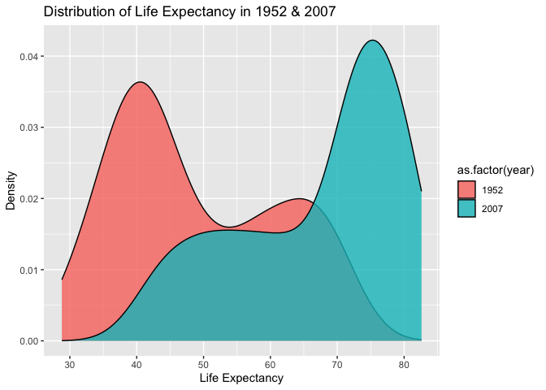
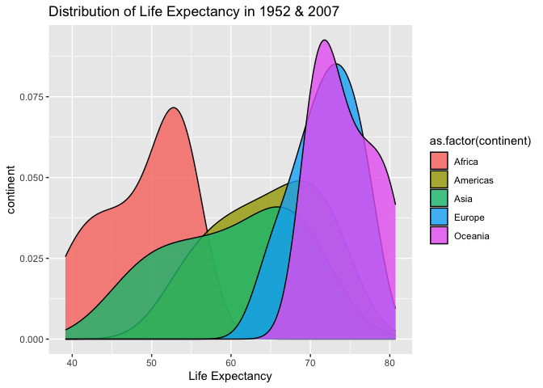
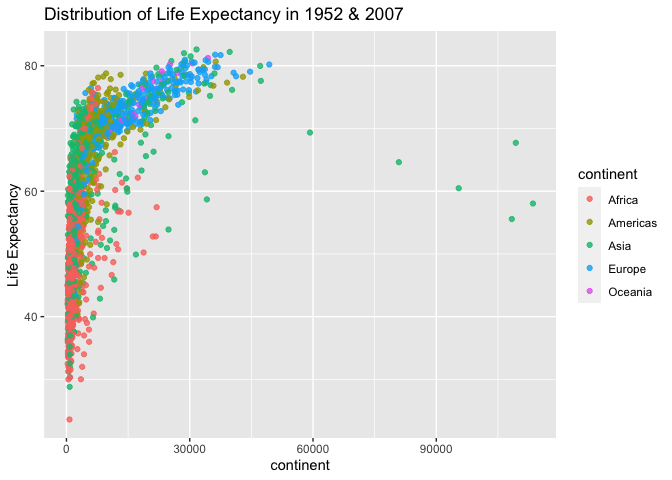
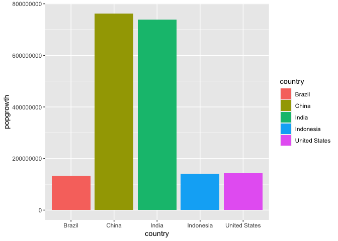
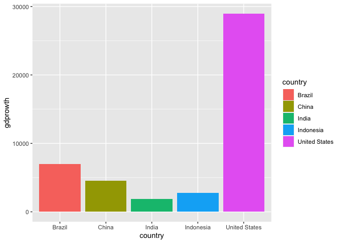
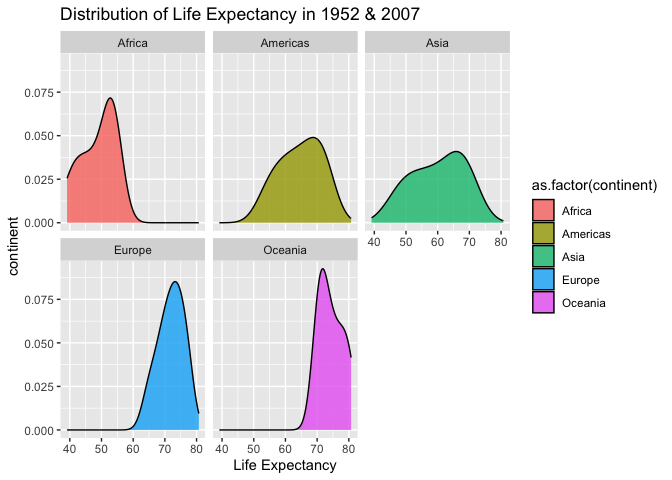

## Instructions
Answer the following questions and complete the exercises in RMarkdown. Please embed all of your code and push your final work to your repository. Your final lab report should be organized, clean, and run free from errors. Remember, you must remove the `#` for the included code chunks to run. Be sure to add your name to the author header above. For any included plots, make sure they are clearly labeled. You are free to use any plot type that you feel best communicates the results of your analysis.  

**In this homework, you should make use of the aesthetics you have learned. It's OK to be flashy!**

Make sure to use the formatting conventions of RMarkdown to make your report neat and clean!  

## Load the libraries

```r
library(tidyverse)
library(janitor)
library(here)
library(naniar)
```


```r
options(scipen = 999)
```

## Resources
The idea for this assignment came from [Rebecca Barter's](http://www.rebeccabarter.com/blog/2017-11-17-ggplot2_tutorial/) ggplot tutorial so if you get stuck this is a good place to have a look.  

## Gapminder
For this assignment, we are going to use the dataset [gapminder](https://cran.r-project.org/web/packages/gapminder/index.html). Gapminder includes information about economics, population, and life expectancy from countries all over the world. You will need to install it before use. This is the same data that we will use for midterm 2 so this is good practice.

```r
#install.packages("gapminder")
library("gapminder")
```

## Questions
The questions below are open-ended and have many possible solutions. Your approach should, where appropriate, include numerical summaries and visuals. Be creative; assume you are building an analysis that you would ultimately present to an audience of stakeholders. Feel free to try out different `geoms` if they more clearly present your results.  

**1. Use the function(s) of your choice to get an idea of the overall structure of the data frame, including its dimensions, column names, variable classes, etc. As part of this, determine how NAs are treated in the data.**  

```r
str(gapminder)
```

```
## tibble [1,704 × 6] (S3: tbl_df/tbl/data.frame)
##  $ country  : Factor w/ 142 levels "Afghanistan",..: 1 1 1 1 1 1 1 1 1 1 ...
##  $ continent: Factor w/ 5 levels "Africa","Americas",..: 3 3 3 3 3 3 3 3 3 3 ...
##  $ year     : int [1:1704] 1952 1957 1962 1967 1972 1977 1982 1987 1992 1997 ...
##  $ lifeExp  : num [1:1704] 28.8 30.3 32 34 36.1 ...
##  $ pop      : int [1:1704] 8425333 9240934 10267083 11537966 13079460 14880372 12881816 13867957 16317921 22227415 ...
##  $ gdpPercap: num [1:1704] 779 821 853 836 740 ...
```


**2. Among the interesting variables in gapminder is life expectancy. How has global life expectancy changed between 1952 and 2007?**

```r
gapminder %>%
  filter(year>=195 & year<=2007)
```

```
## # A tibble: 1,704 × 6
##    country     continent  year lifeExp      pop gdpPercap
##    <fct>       <fct>     <int>   <dbl>    <int>     <dbl>
##  1 Afghanistan Asia       1952    28.8  8425333      779.
##  2 Afghanistan Asia       1957    30.3  9240934      821.
##  3 Afghanistan Asia       1962    32.0 10267083      853.
##  4 Afghanistan Asia       1967    34.0 11537966      836.
##  5 Afghanistan Asia       1972    36.1 13079460      740.
##  6 Afghanistan Asia       1977    38.4 14880372      786.
##  7 Afghanistan Asia       1982    39.9 12881816      978.
##  8 Afghanistan Asia       1987    40.8 13867957      852.
##  9 Afghanistan Asia       1992    41.7 16317921      649.
## 10 Afghanistan Asia       1997    41.8 22227415      635.
## # ℹ 1,694 more rows
```

**3. How do the distributions of life expectancy compare for the years 1952 and 2007?**

```r
gapminder %>%
  filter(year== 1952 | year== 2007) %>%
  ggplot(aes(x=lifeExp, fill=as.factor(year))) +
  geom_density(alpha=0.8)+
  labs(title = "Distribution of Life Expectancy in 1952 & 2007",
       x= "Life Expectancy", 
       y="Density")
```

<!-- -->


**4. Your answer above doesn't tell the whole story since life expectancy varies by region. Make a summary that shows the min, mean, and max life expectancy by continent for all years represented in the data.**


```r
gapminder %>%
  summarise(min_life=min(lifeExp),
                         max_life=max(lifeExp),
                                      mean_life=mean(lifeExp)) 
```

```
## # A tibble: 1 × 3
##   min_life max_life mean_life
##      <dbl>    <dbl>     <dbl>
## 1     23.6     82.6      59.5
```


**5. How has life expectancy changed between 1952-2007 for each continent?**

```r
gapminder %>%
  group_by(year, continent) %>%
 summarise(mean_lifeExp=mean(lifeExp)) %>%
  ggplot(aes(x=mean_lifeExp, fill=as.factor(continent))) +
  geom_density(alpha=0.8)+
  labs(title = "Distribution of Life Expectancy in 1952 & 2007",
       x= "Life Expectancy", 
       y="continent")
```

```
## `summarise()` has grouped output by 'year'. You can override using the
## `.groups` argument.
```

<!-- -->


**6. We are interested in the relationship between per capita GDP and life expectancy; i.e. does having more money help you live longer?**

```r
gapminder %>%
  ggplot(aes(x=lifeExp, y=gdpPercap, color=continent)) +
  geom_point(alpha=0.8)+
  labs(title = "Distribution of Life Expectancy in 1952 & 2007",
       x= "Life Expectancy", 
       y="continent")+
  coord_flip()
```

<!-- -->

**7. Which countries have had the largest population growth since 1952?**

```r
gapminder %>%
  filter(year==1952 | year == 2007)%>%
  pivot_wider(names_from= year, values_from = pop, names_prefix= "pop") %>%
  group_by(country) %>%
  summarise(across(starts_with("pop"), sum, na.rm = TRUE), groups= "drop") %>%
  mutate(popgrowth=pop2007-pop1952) %>%
  arrange(desc(popgrowth))
```

```
## Warning: There was 1 warning in `summarise()`.
## ℹ In argument: `across(starts_with("pop"), sum, na.rm = TRUE)`.
## ℹ In group 1: `country = "Afghanistan"`.
## Caused by warning:
## ! The `...` argument of `across()` is deprecated as of dplyr 1.1.0.
## Supply arguments directly to `.fns` through an anonymous function instead.
## 
##   # Previously
##   across(a:b, mean, na.rm = TRUE)
## 
##   # Now
##   across(a:b, \(x) mean(x, na.rm = TRUE))
```

```
## # A tibble: 142 × 5
##    country         pop1952    pop2007 groups popgrowth
##    <fct>             <int>      <int> <chr>      <int>
##  1 China         556263527 1318683096 drop   762419569
##  2 India         372000000 1110396331 drop   738396331
##  3 United States 157553000  301139947 drop   143586947
##  4 Indonesia      82052000  223547000 drop   141495000
##  5 Brazil         56602560  190010647 drop   133408087
##  6 Pakistan       41346560  169270617 drop   127924057
##  7 Bangladesh     46886859  150448339 drop   103561480
##  8 Nigeria        33119096  135031164 drop   101912068
##  9 Mexico         30144317  108700891 drop    78556574
## 10 Philippines    22438691   91077287 drop    68638596
## # ℹ 132 more rows
```


**8. Use your results from the question above to plot population growth for the top five countries since 1952.**

```r
gapminder %>%
  filter(year==1952 | year == 2007)%>%
  pivot_wider(names_from= year, values_from = pop, names_prefix= "pop") %>%
  group_by(country) %>%
  summarise(across(starts_with("pop"), sum, na.rm = TRUE), groups= "drop") %>%
  mutate(popgrowth=pop2007-pop1952) %>%
  top_n(5) %>%
  ggplot(aes(x=popgrowth, y=country, fill=country))+
  geom_col()+
  coord_flip()
```

```
## Selecting by popgrowth
```

<!-- -->


**9. How does per capita GDP growth compare between these same five countries?**

```r
gapminder%>%
  filter(year==1952 | year == 2007)%>%
  pivot_wider(names_from= year, values_from = gdpPercap, names_prefix= "gdp") %>%
  group_by(country) %>%
  summarise(across(starts_with("gdp"), sum, na.rm = TRUE), groups= "drop") %>%
  mutate(gdprowth=gdp2007-gdp1952) %>%
  filter(country %in% c("Brazil", "China", "India", "Indonesia", "United States"))%>%
  ggplot(aes(x=gdprowth, y=country, fill=country))+
  geom_col()+
  coord_flip()
```

<!-- -->


**10. Make one plot of your choice that uses faceting!**

```r
gapminder %>%
  group_by(year, continent) %>%
 summarise(mean_lifeExp=mean(lifeExp)) %>%
  ggplot(aes(x=mean_lifeExp, fill=as.factor(continent))) +
  geom_density(alpha=0.8)+
  labs(title = "Distribution of Life Expectancy in 1952 & 2007",
       x= "Life Expectancy", 
       y="continent")+
  facet_wrap(~continent)
```

```
## `summarise()` has grouped output by 'year'. You can override using the
## `.groups` argument.
```

<!-- -->


## Push your final code to GitHub!
Please be sure that you check the `keep md` file in the knit preferences. 
