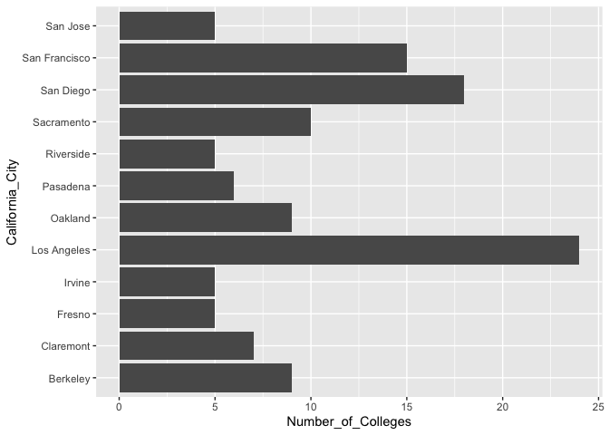
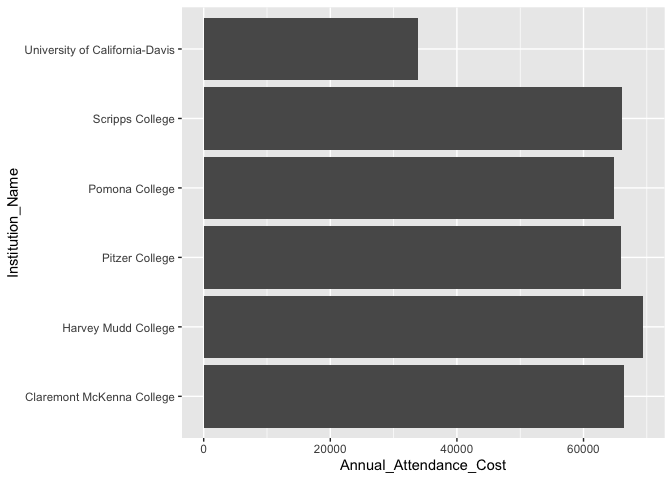
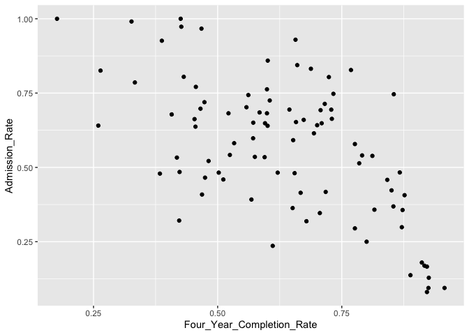
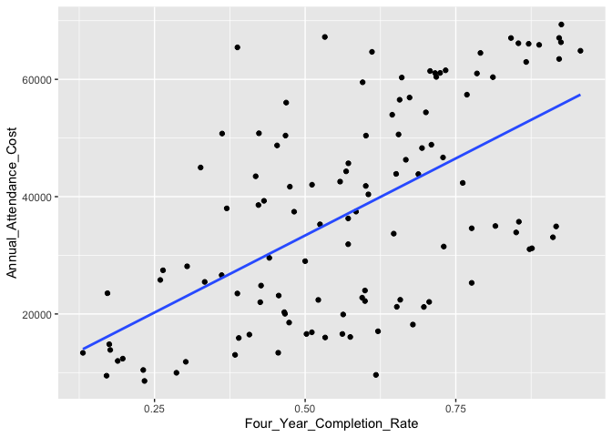
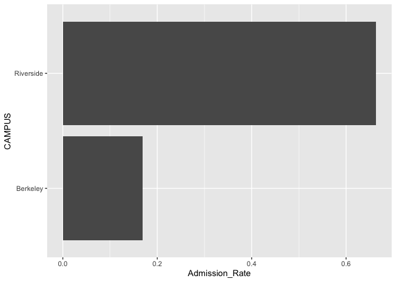
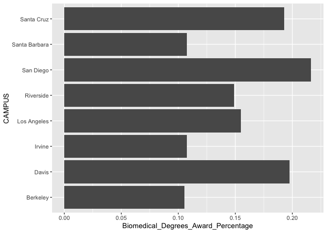

## Instructions
Answer the following questions and complete the exercises in RMarkdown. Please embed all of your code and push your final work to your repository. Your final lab report should be organized, clean, and run free from errors. Remember, you must remove the `#` for the included code chunks to run. Be sure to add your name to the author header above.  

Make sure to use the formatting conventions of RMarkdown to make your report neat and clean!  

## Load the libraries

```r
library(tidyverse)
library(janitor)
library(here)
library(naniar)
library(dplyr)
```

For this homework, we will take a departure from biological data and use data about California colleges. These data are a subset of the national college scorecard (https://collegescorecard.ed.gov/data/). Load the `ca_college_data.csv` as a new object called `colleges`.

```r
colleges <- readr::read_csv("../../lab10/data/ca_college_data.csv")
```

```
## Rows: 341 Columns: 10
## ── Column specification ────────────────────────────────────────────────────────
## Delimiter: ","
## chr (4): INSTNM, CITY, STABBR, ZIP
## dbl (6): ADM_RATE, SAT_AVG, PCIP26, COSTT4_A, C150_4_POOLED, PFTFTUG1_EF
## 
## ℹ Use `spec()` to retrieve the full column specification for this data.
## ℹ Specify the column types or set `show_col_types = FALSE` to quiet this message.
```

The variables are a bit hard to decipher, here is a key:  

INSTNM: Institution name  
CITY: California city  
STABBR: Location state  
ZIP: Zip code  
ADM_RATE: Admission rate  
SAT_AVG: SAT average score  
PCIP26: Percentage of degrees awarded in Biological And Biomedical Sciences  
COSTT4_A: Annual cost of attendance  
C150_4_POOLED: 4-year completion rate  
PFTFTUG1_EF: Percentage of undergraduate students who are first-time, full-time degree/certificate-seeking undergraduate students  

1. Use your preferred function(s) to have a look at the data and get an idea of its structure. Make sure you summarize NA's and determine whether or not the data are tidy. You may also consider dealing with any naming issues.

```r
glimpse(colleges)
```

```
## Rows: 341
## Columns: 10
## $ INSTNM        <chr> "Grossmont College", "College of the Sequoias", "College…
## $ CITY          <chr> "El Cajon", "Visalia", "San Mateo", "Ventura", "Oxnard",…
## $ STABBR        <chr> "CA", "CA", "CA", "CA", "CA", "CA", "CA", "CA", "CA", "C…
## $ ZIP           <chr> "92020-1799", "93277-2214", "94402-3784", "93003-3872", …
## $ ADM_RATE      <dbl> NA, NA, NA, NA, NA, NA, NA, NA, NA, NA, NA, NA, NA, NA, …
## $ SAT_AVG       <dbl> NA, NA, NA, NA, NA, NA, NA, NA, NA, NA, NA, NA, NA, NA, …
## $ PCIP26        <dbl> 0.0016, 0.0066, 0.0038, 0.0035, 0.0085, 0.0151, 0.0000, …
## $ COSTT4_A      <dbl> 7956, 8109, 8278, 8407, 8516, 8577, 8580, 9181, 9281, 93…
## $ C150_4_POOLED <dbl> NA, NA, NA, NA, NA, NA, 0.2334, NA, NA, NA, NA, 0.1704, …
## $ PFTFTUG1_EF   <dbl> 0.3546, 0.5413, 0.3567, 0.3824, 0.2753, 0.4286, 0.2307, …
```

```r
names(colleges)
```

```
##  [1] "INSTNM"        "CITY"          "STABBR"        "ZIP"          
##  [5] "ADM_RATE"      "SAT_AVG"       "PCIP26"        "COSTT4_A"     
##  [9] "C150_4_POOLED" "PFTFTUG1_EF"
```

```r
names(colleges) <- c("Institution_Name", "California_City", "Location_State", "ZIP_Code", "Admission_Rate", "SAT_Average_Score", "Biomedical_Degrees_Award_Percentage", "Annual_Attendance_Cost", "Four_Year_Completion_Rate", "First_Time_Full_Time_Undergrad_Percentage")
```


2. Which cities in California have the highest number of colleges?

```r
college_counts <- colleges %>%
  group_by(California_City) %>%
  filter(n()!="NA") %>%
  summarise(Number_of_Colleges = n()) %>%
  arrange(desc(Number_of_Colleges))
college_counts
```

```
## # A tibble: 161 × 2
##    California_City Number_of_Colleges
##    <chr>                        <int>
##  1 Los Angeles                     24
##  2 San Diego                       18
##  3 San Francisco                   15
##  4 Sacramento                      10
##  5 Berkeley                         9
##  6 Oakland                          9
##  7 Claremont                        7
##  8 Pasadena                         6
##  9 Fresno                           5
## 10 Irvine                           5
## # ℹ 151 more rows
```


3. Based on your answer to #2, make a plot that shows the number of colleges in the top 10 cities.

```r
 college_counts %>%
  arrange(desc(Number_of_Colleges))%>%
  top_n(10,Number_of_Colleges) %>%
ggplot(aes(x = California_City, y = Number_of_Colleges)) +
  geom_col()  +
  coord_flip()
```

<!-- -->

4. The column `COSTT4_A` is the annual cost of each institution. Which city has the highest average cost? Where is it located?

```r
highest_avg_cost_city <- colleges %>%
 filter(Annual_Attendance_Cost!="NA") %>%
  group_by(California_City, Location_State) %>% 
  summarise(Average_Cost = mean(Annual_Attendance_Cost), .groups = 'drop') %>%
  arrange(desc(Average_Cost))%>%
  top_n(1, Average_Cost)
highest_avg_cost_city
```

```
## # A tibble: 1 × 3
##   California_City Location_State Average_Cost
##   <chr>           <chr>                 <dbl>
## 1 Claremont       CA                    66498
```


5. Based on your answer to #4, make a plot that compares the cost of the individual colleges in the most expensive city. Bonus! Add UC Davis here to see how it compares :>).

```r
colleges %>% 
  filter(Annual_Attendance_Cost!="NA")%>%
  filter(California_City == highest_avg_cost_city$California_City | California_City=="Davis") %>%
  ggplot(aes(x = Institution_Name, y = Annual_Attendance_Cost ))+
  geom_col()  +
  coord_flip()
```

<!-- -->


6. The column `ADM_RATE` is the admissions rate by college and `C150_4_POOLED` is the four-year completion rate. Use a scatterplot to show the relationship between these two variables. What do you think this means?

```r
colleges %>% 
  filter(Four_Year_Completion_Rate!="NA" & Admission_Rate !='NA') %>%
  ggplot(aes(x = Four_Year_Completion_Rate, y = Admission_Rate)) +
  geom_point()  
```

<!-- -->


7. Is there a relationship between cost and four-year completion rate? (You don't need to do the stats, just produce a plot). What do you think this means?

```r
colleges %>% 
  filter(Four_Year_Completion_Rate!="NA" & Annual_Attendance_Cost !='NA') %>%
  ggplot(aes(x = Four_Year_Completion_Rate, y = Annual_Attendance_Cost)) +
  geom_point(na.rm=T)+
  geom_smooth(method=lm, se=F, na.rm=T) 
```

```
## `geom_smooth()` using formula = 'y ~ x'
```

<!-- -->

8. The column titled `INSTNM` is the institution name. We are only interested in the University of California colleges. Make a new data frame that is restricted to UC institutions. You can remove `Hastings College of Law` and `UC San Francisco` as we are only interested in undergraduate institutions.

Remove `Hastings College of Law` and `UC San Francisco` and store the final data frame as a new object `univ_calif_final`.

Use `separate()` to separate institution name into two new columns "UNIV" and "CAMPUS".


```r
univ_calif_final <- colleges %>% 
  filter_all(any_vars(str_detect(., pattern = "University of California"))) %>%
filter(California_City!="San Francisco") %>%
    separate(Institution_Name, into = c("UNIV", "CAMPUS"), sep = "-")
(univ_calif_final)
```

```
## # A tibble: 8 × 11
##   UNIV             CAMPUS California_City Location_State ZIP_Code Admission_Rate
##   <chr>            <chr>  <chr>           <chr>          <chr>             <dbl>
## 1 University of C… San D… La Jolla        CA             92093             0.357
## 2 University of C… Irvine Irvine          CA             92697             0.406
## 3 University of C… River… Riverside       CA             92521             0.663
## 4 University of C… Los A… Los Angeles     CA             90095-1…          0.180
## 5 University of C… Davis  Davis           CA             95616-8…          0.423
## 6 University of C… Santa… Santa Cruz      CA             95064-1…          0.578
## 7 University of C… Berke… Berkeley        CA             94720             0.169
## 8 University of C… Santa… Santa Barbara   CA             93106             0.358
## # ℹ 5 more variables: SAT_Average_Score <dbl>,
## #   Biomedical_Degrees_Award_Percentage <dbl>, Annual_Attendance_Cost <dbl>,
## #   Four_Year_Completion_Rate <dbl>,
## #   First_Time_Full_Time_Undergrad_Percentage <dbl>
```


9. The column `ADM_RATE` is the admissions rate by campus. Which UC has the lowest and highest admissions rates? Produce a numerical summary and an appropriate plot.

```r
rates <- univ_calif_final %>%
  summarise(
    Lowest_Rate = min(Admission_Rate, na.rm = TRUE),
    Highest_Rate = max(Admission_Rate, na.rm = TRUE)
  )
```

```r
lowest_highest_campus <- univ_calif_final %>%
  filter(Admission_Rate == rates$Lowest_Rate | Admission_Rate == rates$Highest_Rate) %>%
  select(CAMPUS, Admission_Rate) %>%
  ggplot(aes(x = CAMPUS, y = Admission_Rate ))+
  geom_col()  +
  coord_flip()
lowest_highest_campus
```

<!-- -->


10. If you wanted to get a degree in biological or biomedical sciences, which campus confers the majority of these degrees? Produce a numerical summary and an appropriate plot.

```r
bio_degrees_summary <- univ_calif_final %>%
  arrange(desc(Biomedical_Degrees_Award_Percentage))
(bio_degrees_summary)
```

```
## # A tibble: 8 × 11
##   UNIV             CAMPUS California_City Location_State ZIP_Code Admission_Rate
##   <chr>            <chr>  <chr>           <chr>          <chr>             <dbl>
## 1 University of C… San D… La Jolla        CA             92093             0.357
## 2 University of C… Davis  Davis           CA             95616-8…          0.423
## 3 University of C… Santa… Santa Cruz      CA             95064-1…          0.578
## 4 University of C… Los A… Los Angeles     CA             90095-1…          0.180
## 5 University of C… River… Riverside       CA             92521             0.663
## 6 University of C… Santa… Santa Barbara   CA             93106             0.358
## 7 University of C… Irvine Irvine          CA             92697             0.406
## 8 University of C… Berke… Berkeley        CA             94720             0.169
## # ℹ 5 more variables: SAT_Average_Score <dbl>,
## #   Biomedical_Degrees_Award_Percentage <dbl>, Annual_Attendance_Cost <dbl>,
## #   Four_Year_Completion_Rate <dbl>,
## #   First_Time_Full_Time_Undergrad_Percentage <dbl>
```

```r
bio_degrees_summary %>%
   ggplot(aes(x = CAMPUS, y = Biomedical_Degrees_Award_Percentage)) +
  geom_col()  +
  coord_flip()
```

<!-- -->


## Knit Your Output and Post to [GitHub](https://github.com/FRS417-DataScienceBiologists)
